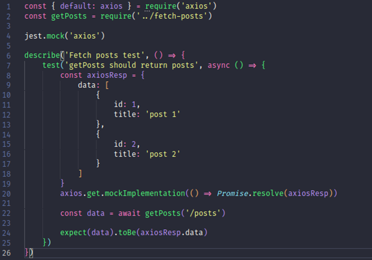

<!-- _class: main -->
# Test Doubles

---
<!-- _class: doubles -->
# Test Doubles
Mock

Stub

Spy

Fake

Dummy

---
<!-- _class: mock li -->
# Mock
- Simula uma dependência externa de teste
- Usa-se para saber…
    - …se um método de uma dependência externa foi chamado;
    - …quantas vezes tal método foi chamado;
    - …se o método foi chamado com os parâmetros esperados.

---
<!-- _class: stub li -->
# Stub
- Também simula uma dependência externa de teste
- Usa-se para…
    - …definir um retorno da dependência externa;
    - …testar o comportamento do método com base nos retornos da dependência externa.

---
<!-- _class: spy li -->
# Spy
- Espia uma dependência externa
- Usa-se para verificar o comportamento do método a ser espionado

---
<!-- _class: fake li -->
# Fake
- Objeto falso, muito próximo do objeto real, contendo no mínimo as propriedades que precisamos para nosso teste

---
<!-- _class: dummy li -->
# Dummy
- Só ocupa espaço
- São argumentos utilizados para preencher parâmetros de um método para cumprir o contrato do método
- Não produz quaisquer efeitos no teste

